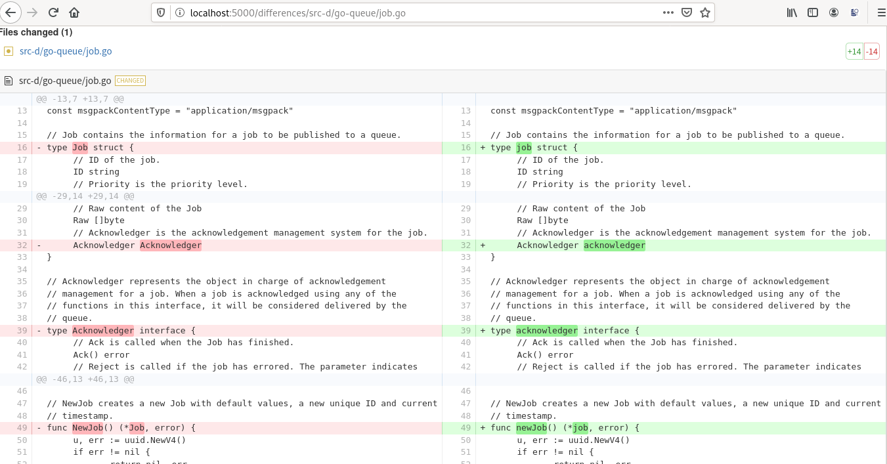

# diff-viewer

**diff-viewer** allows us to visualize the differences between two versions of a file, in GitHub-like style. It's focused on comparing the current version against the post-processed version, created by [src_reader](https://github.com/eroatta/src-reader).

## Usage

Open a new browser window or tab, and enter the URL: _http://address:port_*/differences/$owner/$repository/$filename*

Example:
- http://localhost:5000/differences/src-d/go-queue/job.go

## Screenshots

## Inspiration

Adapted from the examples on [react-gh-like-diff](https://github.com/neighborhood999/react-gh-like-diff).

## License

See the [LICENSE](LICENSE) file for license rights and limitations (MIT).
